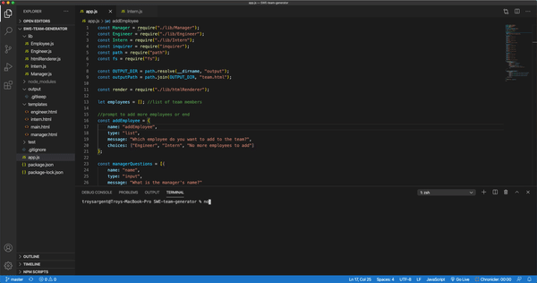

# Software Engineer Team Profile Generator  
  This is a CLI interface that generates an html overview page of a software engineer team. I built this using Jest for Test Driven Development and ES6 Classes. 
  ## Demo
   
  ## Table of Contents
  - [Installation](#Installation)
  - [Usage](#Usage)
  - [Testing](#Testing)
  - [License](#License)
  ## Installation
  ```git clone git@github.com:TroySargent/swe-team-generator.git```
  ## Usage
  ```
  npm install
  node app.js
  ```
  ## Testing
  ```
  npm test
  ```
  ## License
  This project is licensed under the MIT license.
  ### [Check out my other projects](https://github.com/TroySargent)